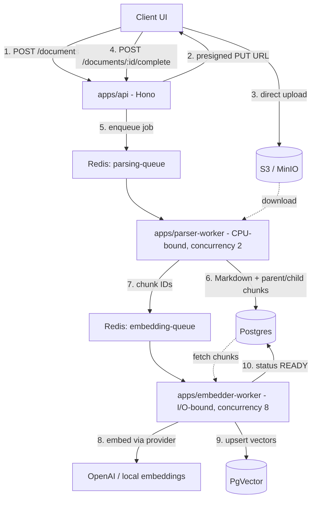

# ts-refinery

Industrial-grade document ingestion and ETL pipeline for RAG systems. Raw files (PDF, DOCX,
HTML) are compiled into structured Markdown, chunked along semantic boundaries into a
parent-child hierarchy, and embedded asynchronously — so the vector database only ever
receives context-rich, structure-aware gold.

**Core philosophy**

1. **Documents are code** — raw binaries are compiled to an intermediate representation
   (Markdown) before chunking.
2. **Structure is context** — chunks split on headers/paragraphs/tables/code fences, never
   on character counts. Every chunk carries its `headerPath`.
3. **Isolation of concerns** — CPU-bound parsing and I/O-bound embedding run in physically
   separate worker processes with different concurrency profiles.

## Architecture



The API **never parses anything inside the HTTP lifecycle** — a 500MB PDF upload goes
straight to object storage, and all heavy lifting happens in workers behind queues.

### Parent-child chunking

- **Parents** (≤ `MAX_PARENT_TOKENS`, default 1000): section-sized context chunks fed to
  the LLM at retrieval time. The section's header line is kept inside the first parent part.
- **Children** (≤ `MAX_CHILD_TOKENS`, default 250): small, highly specific chunks used for
  vector search; each references its parent via `chunks.parent_id`.
- A parent small enough to stand alone **is its own search unit** — no duplicated
  embeddings are ever stored.
- Tables and fenced code blocks are atomic: no split can cut through them.

Document status machine: `PENDING → PARSING → EMBEDDING → READY` (or `FAILED` after all
retry attempts are exhausted).

## Repository layout

| Path | Purpose |
| --- | --- |
| `apps/api` | Hono server: presigned uploads, upload-complete → enqueue, status checks |
| `apps/parser-worker` | BullMQ worker (CPU-bound): download → parse → metadata → chunk → persist |
| `apps/embedder-worker` | BullMQ worker (I/O-bound): embed search units → upsert vectors → READY |
| `packages/config` | Env validation (`loadEnv`) shared by every process boundary |
| `packages/db` | Drizzle schema (`documents`, `chunks`, `chunk_embeddings`) + migrations |
| `packages/queue` | Queue names, Zod job payload contracts, BullMQ factories |
| `packages/storage` | S3 client, presigning, object helpers (works with MinIO) |
| `packages/parser-core` | PDF / DOCX / HTML / text → Markdown compiler |
| `packages/chunking-engine` | Structure-aware parent-child chunking |
| `packages/metadata-extractor` | Regex-rule metadata extraction + Zod validation |
| `packages/embedding-core` | Embedding providers (OpenAI, fake) + vector store abstraction |

## Quickstart

```bash
corepack enable            # pnpm is pinned via packageManager field
pnpm install
pnpm build                 # tsup builds all packages (turbo, topological)

docker compose up -d       # Postgres (pgvector), Redis, MinIO + bucket bootstrap
cp .env.example .env       # adjust OPENAI_API_KEY or set EMBEDDING_PROVIDER=fake
pnpm db:migrate

pnpm --filter @repo/api dev            # terminal 1 — API on :3000
pnpm --filter @repo/parser-worker dev  # terminal 2
pnpm --filter @repo/embedder-worker dev# terminal 3
```

### Upload flow

```bash
# 1. Register the document
curl -s localhost:3000/documents -H 'content-type: application/json' -d '{
  "fileName": "annual-report.html",
  "mimeType": "text/html",
  "sizeBytes": 12345
}'
# -> { "documentId": "...", "uploadUrl": "http://localhost:9000/...", ... }

# 2. Upload the bytes directly to object storage
curl -X PUT -H 'content-type: text/html' --data-binary @annual-report.html "$UPLOAD_URL"

# 3. Signal completion -> enqueues the parse job
curl -s -X POST localhost:3000/documents/$DOCUMENT_ID/complete
# -> 202 { "documentId": "...", "status": "QUEUED_FOR_PARSING" }

# 4. Poll status
curl -s localhost:3000/documents/$DOCUMENT_ID
# -> { "status": "READY", "chunkCounts": { "total": 42, "parents": 10, "children": 32 }, ... }
```

Supported mime types: `application/pdf`,
`application/vnd.openxmlformats-officedocument.wordprocessingml.document`, `text/html`,
`text/markdown`, `text/plain`.

## Configuration

All env vars are Zod-validated at boot (fail fast, readable errors). See `.env.example`
for the full list. Highlights:

| Variable | Default | Notes |
| --- | --- | --- |
| `PARSER_CONCURRENCY` | `2` | CPU-bound — keep low |
| `EMBEDDER_CONCURRENCY` | `8` | I/O-bound — scale up freely |
| `MAX_PARENT_TOKENS` / `MAX_CHILD_TOKENS` | `1000` / `250` | Chunk budget (est. tokens, ~4 chars/token) |
| `EMBEDDING_PROVIDER` | `openai` | `fake` for deterministic offline dev/testing |
| `EMBEDDING_DIMENSIONS` | `1536` | Must match the schema (`EMBEDDING_DIMENSIONS`) — changing it needs a migration **and** full re-embed |

## Testing

```bash
pnpm test       # vitest across all packages/workspaces (turbo)
pnpm typecheck  # tsc --noEmit everywhere
pnpm lint       # eslint (flat config, typescript-eslint)
```

- **chunking-engine**: edge cases for nested headers, header jumps, empty docs, oversized
  sections, atomic tables and code fences, parent/child invariants.
- **parser-core**: HTML → Markdown, a programmatically generated minimal real PDF
  (correct xref offsets, no binary fixtures), unsupported-type errors.
- **workers**: handlers are dependency-injected (`ParserStore` / `EmbedderStore`), so the
  full job lifecycle is tested against in-memory fakes — no Postgres/Redis in CI.
- **No LLM calls in CI**: embedding tests use `FakeEmbeddingProvider` or mocked `fetch`.

## Design notes & deviations from the TRD

This repo implements the TRD faithfully, with these deliberate corrections/additions:

1. **Cross-queue handoff uses `Queue.add()`**, not a raw `RPUSH` to `bull:embedding-queue`
   (as sketched in the TRD). Raw Redis writes bypass BullMQ's job format (ids, options,
   timestamps) and workers would never pick them up.
2. **DOCX path is `mammoth.convertToHtml` + turndown** — `mammoth.convertToMarkdown` no
   longer exists in mammoth (which is exactly why the TRD's dependency list includes
   turndown).
3. **`packages/storage`** houses the S3 client; the TRD referenced a `@repo/infra` package
   that its own directory tree never defined.
4. **Parent-child chunking is fully implemented** (the TRD declared `parentId` in the
   schema but its chunker sketch only produced flat chunks). Empty/header-only sections
   are skipped instead of emitting empty chunks, and section headers stay inside chunk
   content.
5. **`docker-compose.yml` uses `pgvector/pgvector:pg16`** since PgVector is the vector
   store; plain `postgres:16-alpine` lacks the extension. A one-shot `minio/mc` service
   bootstraps the bucket.
6. **`FAILED` is only set after the final retry attempt** (worker `failed` event +
   `attemptsMade` check), so retrying documents truthfully report `PARSING`.
7. **Empty documents (e.g. scanned image-only PDFs) go straight to `READY`** with zero
   chunks instead of hanging in `EMBEDDING`. OCR is explicitly out of scope for v1.
8. **Embedding input is prefixed with the header breadcrumb** (`Section 4 > Leases`) so
   vectors encode structural context, and parsing runs rule-based metadata extraction
   (`metadata-extractor`) merged with parser-native metadata (PDF info dict, HTML `<title>`).
9. **Migrations**: `packages/db/drizzle/0000_initial_schema.sql` was hand-written to match
   the Drizzle schema (incl. the `vector` extension and an HNSW cosine index). If you
   change the schema before running against real data, delete `packages/db/drizzle` and
   run `pnpm db:generate` to regenerate a drizzle-managed history.

## Production considerations

- **Scale out** by running more parser-worker / embedder-worker processes; they are
  stateless apart from their queue connections.
- **Idempotency**: re-parsing deletes and replaces a document's chunks in a transaction;
  embedding upserts by chunk id. All jobs are safe to retry.
- **Swapping vector stores**: implement the `VectorStore` interface from
  `embedding-core` (e.g. Qdrant) and adjust `markEmbedded`; the relational model in
  Postgres stays the source of truth.
- **Token counts** use a ~4 chars/token heuristic; swap `estimateTokens` for tiktoken if
  exact budgets matter.
